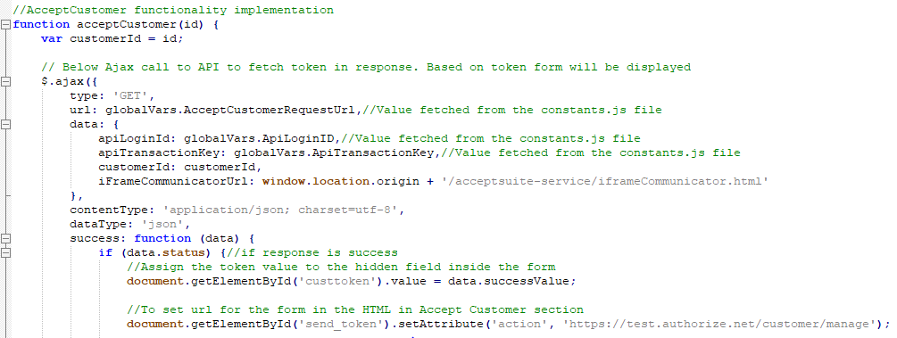

# Deploy Accept Suite Java Application

## Very detailed explanation of each product type.

Authorized.Net Accept suite has below products.
*	Accept JS
*	Accept UI
*	Accept Hosted
*	Accept Customer

Detailed explanation of each product are available in the below links.
https://developer.authorize.net/api/reference/features/accept.html
https://developer.authorize.net/api/reference/features/acceptjs.html
https://developer.authorize.net/api/reference/features/accept_hosted.html
https://developer.authorize.net/api/reference/features/customer_profiles.html#Using_the_Accept_Customer_Hosted_Form

## Two ways to deploy Accept Suite Java Application

## [Manual Deployment](../master/README.md#step-by-step-guide-for-manual-deployment)
## [Automatic Deployment](../master/README.md#step-by-step-guide-for-automatic-deployment)

## Steps to download the code from the repository.

* Click on Clone or Download button from the repository.

* Popup Displays 2 Options Open in Desktop or Download ZIP


* Click on Download ZIP and choose the **webapps** folder inside Apache Tomcat Server has installed and UnZip the folder accept-sample-app-java-master.zip.

* Once UnZipped , accept-sample-app-java-master Folder **acceptsuiteservice** folder along with license and readme.md file.


## Step by Step Guide for Manual Deployment:

## Prerequisite:
*	JDK 1.8 or higher version.
*   Maven 2.2.0 or higher version.
*	Eclipse Oxygen IDE or any editor of your choice.
*	Apache Tomcat7.0 Server or higher version.
*  [Steps to create the server in Eclipse IDE](../master/acceptsuiteservice#steps-to-create-the-server-in-eclipse-ide)
*  [Apache Tomcat 7.0 Server OpenSSL configuration](../master/acceptsuiteservice#embed-apache-tomcat-server-openssl-configuration-in-eclipse).
*  Download and install the **jq** library file and configure it.
*  [Download the code from the repository](../master/README.md#steps-to-download-the-code-from-the-repository).
*  Open the folder **acceptsuiteservice**
*  [Publish AcceptSuite Web Service Application with Eclipse IDE](../master/acceptsuiteservice#publish-acceptsuite-web-service-application-with-eclipse-ide)
           				
* Once deployed Successfully by following the steps mentioned in the above link, update the URL's in Constants.js file as described below.

* Constants.js file is located inside scripts folder in the path \WebApp\assets\js\accept-suite.

 

* Constants.js file contains Keys which is used globally across the application. 

## API URL's Section:

The URLs should be provided with static port number in the following format.

**https://localhost:9444/acceptsuite-service/rest/api/acceptjs **

* ApiMethodName parameter is dynamic and that need to be replaced with Product Type name 
detailed description is explained below.

* AcceptJSRequestUrl/AcceptUI.JS RequestUrl : URL to invoke Accept JS web service.

	**Sample URL: https://localhost:9444/acceptsuite-service/rest/api/acceptjs**


* AcceptHostedRequestUrl : URL to get the token value for Accept Hosted.

	**Sample URL: https://localhost:9444/acceptsuite-service/rest/api/accepthosted**


* AcceptCustomerRequestUrl : URL to get the token value for Accept Customer.

	**Sample URL: https://localhost:9444/acceptsuite-service/rest/api/acceptcustomer**


* ValidateCustomerRequestUrl : URL to invoke a web api method to validate customer ID.

	**Sample URL: https://localhost:9444/acceptsuite-service/rest/api/validatecustomer**

## Merchant Authentication Details: 

The following are the parameters with values that remains constant throughout the application. These parameters are used in script through Ajax calls for performing payments.

* ClientKey 


* ApiLoginID


* ApiTransactionKey


## Accept Hosted and Customer form POST URL details

**Accept Hosted**

* User can update the URL at acceptHosted function in assets/js/accept-suite/accept-hosted.js file 


**Accept Customer**

* User can update the URL at acceptCustomer function in assets/js/accept-suite/accept-customer.js file 


		
## Step by Step Guide for Automatic Deployment

## Prerequisite:
*  JDK 1.8 or higher version.
*  Maven 2.2.0 or higher version.
*  Apache Tomcat7.0 Server or higher version.
*  [Apache Tomcat 7.0 Server OpenSSL configuration](../master/acceptsuiteservice#standalone-apache-tomcat-server-openssl-configuration).
*  Download and install the **jq** library file and configure it.

## Steps to download the code from the repository:

* Click on Clone or Download button from the repository.

* Popup Displays 2 Options Open in Desktop or Download ZIP


* Click on Download ZIP and choose the **webapps** folder inside tomcat server has installed and UnZip the folder accept-sample-app-java-master.zip.

* Copy **acceptsuiteservice** folder from UnZiped folder accept-sample-app-java-master and paste it inside **webapps** folder.

### Mandatory steps to be performed before running .sh file

* Goto **scripts** folder sub-directory of **acceptsuiteservice**. 


* Open the **userInputs.json** file and provide the proper SERVER_PATH, PORT_NUMBER and HOST_NAME of the sytem or give localhost.
```
{"SERVER_PATH" : "C:/server/apache-tomcat",
"PORT_NUMBER" : "9444",
"HOST_NAME" : "localhost"}
```
### Run the batch file

*  Run deploy.sh file located inside the scripts folder.
*  Once shell script file successfully execute it will automatically launch the Accept Suite URL: https://localhost:9444/acceptsuite-service/index_all.html in default Web Browser.

