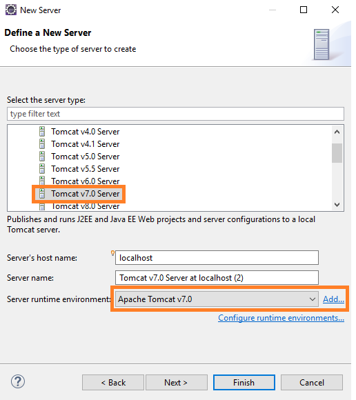
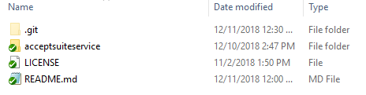
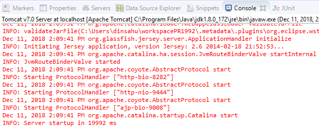

# Deploy Accept Suite Java Application

## Very detailed explanation of each product type.

Authorized.Net Accept suite has below products.
*	Accept JS
*	Accept UI
*	Accept Hosted
*	Accept Customer

Detailed explanation of each product are available in the below links.
https://developer.authorize.net/api/reference/features/accept.html
https://developer.authorize.net/api/reference/features/acceptjs.html
https://developer.authorize.net/api/reference/features/accept_hosted.html
https://developer.authorize.net/api/reference/features/customer_profiles.html#Using_the_Accept_Customer_Hosted_Form

## Two ways to deploy Accept Suite Java Application

## [Manual Deployment](https://github.com/dinsahu/AcceptSuit-Java#step-by-step-guide-for-manual-deployment)

## Step by Step Guide for Manual Deployment:

## Prerequisite:
*	Windows 10 Professional.
*	JDK 1.8 or higher version
*	Eclipse Oxygen IDE or any editor of your choice.
*	Apache Tomcat7.0 Server or higher version.

## Steps to download the code from the repository:

* Click on Clone or Download button from the repository.

* Popup Displays 2 Options Open in Desktop or Download ZIP

* Click on Download ZIP and choose the folder C:\GithubLocal to save.

* UnZip the folder accept-sample-app-java-master.zip

* Once UnZipped , accept-sample-app-java-master Folder acceptsuiteservice folder along with license and readme.md file.

* Open the folder **acceptsuiteservice**

* [Detailed steps are explained on how to deploy on Apache Tomcat Server.](https://github.com/dinsahu/JavaAPITest/tree/master/acceptsuiteservice#deploy-java-web-service-api-application-to-apache-tomcat-server)
                                                                           
* Once deployed Successfully , update the URL's in Constants.js file as described below.

* **Constants.js file is located inside scripts folder in the js folder.** 

* Constants.js file contains Keys which is used globally across the application. 

## API URL's Section:

The URLs should be provided with static port number in the following format.

**https://localhost:9444/acceptsuiteservice/rest/api/acceptjs **

* ApiMethodName parameter is dynamic and that need to be replaced with Product Type name 
detailed description is explained below.

* AcceptJSRequestUrl/AcceptUI.JS RequestUrl : URL to invoke Accept JS web service.

	**Sample URL: https://localhost:9444/acceptsuiteservice/rest/api/acceptjs**

* AcceptHostedRequestUrl : URL to get the token value for Accept Hosted.

	**Sample URL: https://localhost:9444/acceptsuiteservice/rest/api/accepthosted**

* AcceptCustomerRequestUrl : URL to get the token value for Accept Customer.

	**Sample URL: https://localhost:9444/acceptsuiteservice/rest/api/acceptcustomer**

* ValidateCustomerRequestUrl : URL to invoke a web api method to validate customer ID.

	**Sample URL: https://localhost:9444/acceptsuiteservice/rest/api/validatecustomer**

## Merchant Authentication Details: 

The following are the parameters with values that remains constant throughout the application. These parameters are used in script through Ajax calls for performing payments.

* ClientKey 

* ApiLoginID

* ApiTransactionKey

### Steps to create the server in Eclipse IDE

*	Open Server window
*	New > Server
*	Select Tomcat v7.0 Server
*	Select Server runtime environment. Press add

	
	
*	Select the folder where you extracted the server files that you have downloaded

	
	
### Publish AcceptSuite Web Service Application with Eclipse IDE.

* Import acceptsuiteservice folder in Eclipse IDE.

	

* Build the Application.

* Right-click on the acceptsuiteservice project and select Run As-> Run Configuration.
		
    		
			
* Start the server->Next->Finish.
	
	
		
* Verify the Publish in the Output Section.
	
	
		
## browse the website

Sample URL: https://10.173.125.203:9443/AcceptScript/index_all.html

