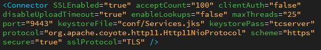

# Accept Suite 

Developer Guide to deploy the Java Web Service API Application on Apache Tomcat Server.

## Prerequisite:
*	Windows 10 Professional.
*	JDK 1.8 or higher version.
*   Maven 2.2.0 or higher version.
*	Eclipse Oxygen IDE or any editor of your choice.
*	Apache Tomcat7.0 Server or higher version.

## Deploy Java Web Service API Application to Apache Tomcat Server.

Please follow step by step procedure to host the Java Web Service API Application to Apache Tomcat Server.

### Apache Tomcat Server configuration

Windows desktop operating systems

* Go to http://tomcat.apache.org/download-70.cgi then download and install Tomcat.

* Set JAVA_HOME environment variable in Windows by Click on Start button in Windows and goto Control Panel->System->Advanced system setting->Environment Variables and give path of JDK installed directory.

* Set JRE_HOME environment variable in Windows by Click on Start button in Windows and goto Control Panel->System->Advanced system setting->Environment Variables and give path of JRE installed directory.

* Start the Server by click on startup.bat file which is kept in the "bin" sub-directory of the Tomcat installed directoryis.

* Openssl/Https configuration in Apache Tomcat server followed by below steps e.g. https://tomcat.apache.org/tomcat-7.0-doc/ssl-howto.html

  * Open Command prompt and Run as administrator  and goto "bin" sub-directory of the JDK installed directoryies.
  
  * Run the command "keytool -genkey -alias server -keyalg RSA -keysize 2048 -keystore Services.jks" to Generate the JKS file.
   
  * Goto "conf" sub-directory of the Eclipse embeded Tomcat installed directoryies and paste the JKS file which is generated by Java Key Tool(e.g. workspace\.metadata\.plugins\org.eclipse.wst.server.core\tmp1\conf).
  
  * Add Connector tag in server.xml file which is given in "conf" sub-directory of the Eclipse embeded Tomcat installed directoryies.
  
	

* Open the browser and search the URL(e.g. https://localhost:9443/).

	
### Publish  AcceptSuite Web Service Application with Eclipse IDE.

* Import AcceptSuite and ane_java_sdk folders in Eclipse IDE.

	

* Build the Application.

* Right-click on the AcceptSuite project and select Run As-> Run Configuration.
		
    		
			
* Start the server->Next->Finish.
	
	
		
* Verify the Publish in the Output Section.
	
	
	
### Create Website on Apache Tomcat Server

*	Open Server window
*	New > Server
*	Select Tomcat v7.0 Server
*	Select Server runtime environment. Press add

	
	
*	Select the folder where you extracted the server files that you have downloaded

	

## Proxy Configuration

* Go to Environment Variables.

* Click on Environment Variables.

* Add System Variables

	**https.useProxy**
	
	 if https.useProxy is set to true need to provide the values for below system variables.
	
	 if https.useProxy is set to false need not provide the values for below system variables.
	
	**https.proxyHost**
	
	 https.proxyHost value should be **userproxy.visa.com**
	
	**https.proxyPort**
	
	 https.proxyPort value should be **443**
	
	**https.proxyUsername**
	
	https.proxyUsername value should be **Your NTUserName**
	
	**https.proxyPassword**
	
	https.proxyPassword value should be **Your NTPassword**
	
	
	
* Click OK.
	
## browse the website. 

For Instance we will verify one of the API Method Validate Customer.

URL: https://<IPAddress>:<PortNumber>/Acceptsuit/api/ValidateCustomer?apiLoginId=78BZ5Xprry&apiTransactionKey=8s2F95Q7brhHd7Tn&customerId=1813212446

* Sample Request URL

**Validate Customer API**: https://10.173.125.203:9443/Acceptsuit/api/ValidateCustomer?apiLoginId=78BZ5Xprry&apiTransactionKey=8s2F95Q7brhHd7Tn&customerId=1813212446

**Accept JS/UI**: https://10.173.125.203:9443/Acceptsuit/api/AcceptJS?apiLoginId=78BZ5Xprry&apiTransactionKey=8s2F95Q7brhHd7Tn&token=eyJjb2RlIjoiNTBfMl8wNjAwMDUyMkIzMkVGQTMyOURENzIzMkFCRENERTczM0JCQkY5RTEyMDdGOUUyMEQxQzJFNEMwNjk0QTQzNjdCQUY5NDZFMDRFNkNBRkRCOEZFQjA4NDI5MjE5OEQyOUI2ODdDMDc3IiwidG9rZW4iOiI5NTM4OTk0MTEwNDY1ODgzMjA0NjAzIiwidiI6IjEuMSJ9

* Response : 
{"successValue":"I00001 Successful.","errorMessage":null,"status":true}

