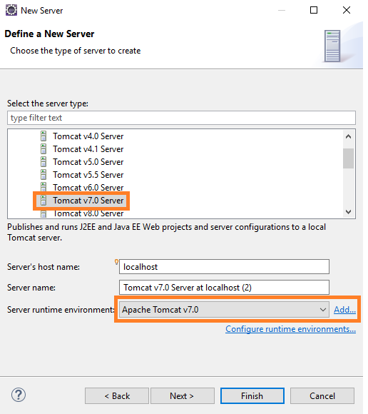
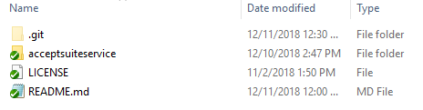
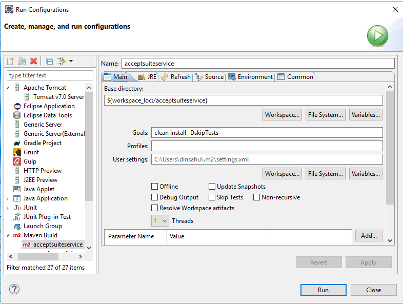
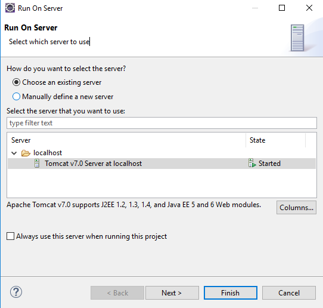
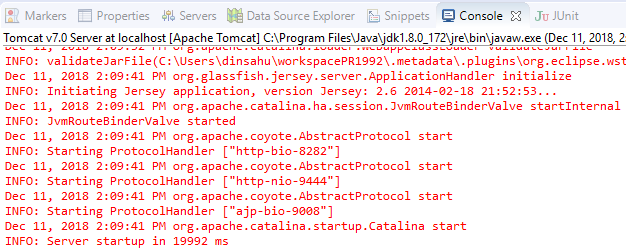
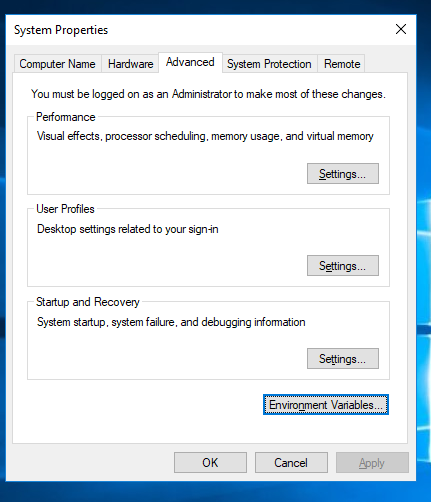
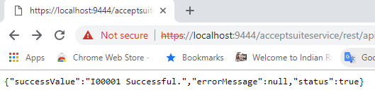

# Accept Suite 

Developer Guide to deploy the Java Web Service API Application on Apache Tomcat Server.

## Prerequisite:
*	JDK 1.8 or higher version.
*   Maven 2.2.0 or higher version.
*	Eclipse Oxygen IDE or any editor of your choice.
*	Apache Tomcat7.0 Server or higher version.

### Steps to create the server in Eclipse IDE

*	Open Server window
*	New > Server
*	Select Tomcat v7.0 Server
*	Select Server runtime environment. Press add

	
	
*	Select the folder where you extracted the server files that you have downloaded

	

## Deploy Java Web Service API Application to Apache Tomcat Server.

Please follow step by step procedure to host the Java Web Service API Application to Apache Tomcat Server.

* Set JAVA_HOME environment variable in Windows by Click on Start button in Windows and goto Control Panel->System->Advanced system setting->Environment Variables and give path of JDK installed directory.

* Set JRE_HOME environment variable in Windows by Click on Start button in Windows and goto Control Panel->System->Advanced system setting->Environment Variables and give path of JRE installed directory.

* Start the Server by click on startup.bat file which is kept in the "bin" sub-directory of the Tomcat installed directoryis.

### Embed Apache Tomcat Server OpenSSL configuration In Eclipse.
 
  * Openssl/Https configuration in Apache Tomcat server followed by below steps e.g. https://tomcat.apache.org/tomcat-7.0-doc/ssl-howto.html
 
  * Open Command prompt and Run as administrator  and goto "bin" sub-directory of the JDK installed directoryies.
  
  * Run the command "keytool -genkey -alias server -keyalg RSA -keysize 2048 -keystore Services.jks" to Generate the JKS file.
   
  * Goto "conf" sub-directory of the Eclipse embeded Tomcat installed directoryies and paste the JKS file which is generated by Java Key Tool(e.g. workspace\.metadata\.plugins\org.eclipse.wst.server.core\tmp1\conf).
  
  * Add Connector tag in server.xml file which is given in "conf" sub-directory of the Tomcat embed Eclipse installed directoryies.
  	```
	<Connector SSLEnabled="true" acceptCount="100" clientAuth="false"
     disableUploadTimeout="true" enableLookups="false" maxThreads="25"
     port="9444" keystoreFile="conf/Services.jks" keystorePass="tcserver"
     protocol="org.apache.coyote.http11.Http11NioProtocol" scheme="https" secure="true" sslProtocol="TLS" />
    ```
  * Open the browser and search the URL(e.g. https://localhost:9444/).

### Standalone Apache Tomcat Server OpenSSL configuration.

  * Openssl/Https configuration in Apache Tomcat server followed by below steps e.g. https://tomcat.apache.org/tomcat-7.0-doc/ssl-howto.html

  * Open Command prompt and Run as administrator  and goto "bin" sub-directory of the JDK installed directoryies.
  
  * Run the command "keytool -genkey -alias server -keyalg RSA -keysize 2048 -keystore Services.jks" to Generate the JKS file.
   
  * Goto "conf" sub-directory of the Standalone Apache Tomcat Server installed directoryies and paste the JKS file which is generated by Java Key Tool(e.g. \server\apache-tomcat\conf).
  
  * Add Connector tag in server.xml file which is given in "conf" sub-directory of the Standalone Apache Tomcat Server installed directoryies.
  	```
	<Connector SSLEnabled="true" acceptCount="100" clientAuth="false"
     disableUploadTimeout="true" enableLookups="false" maxThreads="25"
     port="9444" keystoreFile="conf/Services.jks" keystorePass="tcserver"
     protocol="org.apache.coyote.http11.Http11NioProtocol" scheme="https" secure="true" sslProtocol="TLS" />
    ```	
  * Open the browser and search the URL(e.g. https://localhost:9444/).

### Publish AcceptSuite Web Service Application with Eclipse IDE.

* Import acceptsuiteservice folder in Eclipse IDE.

	
	
* Open script folder for **userInputs.json** file and provide the proper PORT_NUMBER and HOST_NAME of the sytem or give localhost. No need to change SERVER_PATH as it required in Automatic Deployment. 
```
{"SERVER_PATH" : "C:/server/apache-tomcat",
"PORT_NUMBER" : "9444",
"HOST_NAME" : "localhost"}
```
* Build the Application.

* Right-click on the acceptsuiteservice project and select Run As-> Run Configuration.
		
    		
			
* Start the server->Next->Finish.
	
	
		
* Verify the Publish in the Output Section.
	
	
	
## browse the website

Sample URL: https://localhost:9444/acceptsuite-service/index_all.html


## Proxy Configuration

* Go to Environment Variables.

* Click on Environment Variables.



* Add System Variables

	**https.useProxy**
	
	 if https.useProxy is set to true need to provide the values for below system variables.
	
	 if https.useProxy is set to false need not provide the values for below system variables.
	
	**https.proxyHost**
	
	 https.proxyHost value should be **DomainName**
	
	**https.proxyPort**
	
	 https.proxyPort value should be **PortNumber**
	
	**https.proxyUsername**
	
	https.proxyUsername value should be **Your NTUserName**
	
	**https.proxyPassword**
	
	https.proxyPassword value should be **Your NTPassword**
	
## browse the website. 

For Instance we will verify one of the API Method Validate Customer.

URL: https://<IPAddress>:<PortNumber>/acceptsuite-service/rest/api/validatecustomer?apiLoginId=78BZ5Xprry&apiTransactionKey=8s2F95Q7brhHd7Tn&customerId=1813212446

* Sample Request URL

**Validate Customer API**: https://localhost:9444/acceptsuite-service/rest/api/validatecustomer?apiLoginId=78BZ5Xprry&apiTransactionKey=8s2F95Q7brhHd7Tn&customerId=1813212446

**Accept JS/UI**: https://localhost:9444/acceptsuite-service/rest/api/acceptjs?apiLoginId=78BZ5Xprry&apiTransactionKey=8s2F95Q7brhHd7Tn&token=eyJjb2RlIjoiNTBfMl8wNjAwMDUyMkIzMkVGQTMyOURENzIzMkFCRENERTczM0JCQkY5RTEyMDdGOUUyMEQxQzJFNEMwNjk0QTQzNjdCQUY5NDZFMDRFNkNBRkRCOEZFQjA4NDI5MjE5OEQyOUI2ODdDMDc3IiwidG9rZW4iOiI5NTM4OTk0MTEwNDY1ODgzMjA0NjAzIiwidiI6IjEuMSJ9

* Response : 
{"successValue":"I00001 Successful.","errorMessage":null,"status":true}

