# Accept Customer Description

Accept Customer is a fully hosted payment information that allows the creation of customer profile, payment profile and shipping profile with hosted functionality. 

The functionality for Accept Customer is written in pure JavaScript and pages are designed using Bootstrap classes.

## Accessing Accept Customer Page

There are two ways to navigate to Accept.js page.

* The Accept Customer page can be accessed from the dashboard page by clicking on the Accept Customer tab. 
* Access directly by providing the product type and customer ID query strings in the URL.
 
The URL format for Accept Customer is as follows,

https://IPAddress:PortNumber/acceptsuite-service/index.html?producttype=acceptcustomer&CustomerId=1813212446

## Workflow

**Accept Hosted client-side functionality is written in *accept-customer.js* javascript file(..\accept-sample-app-java\acceptsuiteservice\WebApp\assets\js\accept-suite\accept-customer.js).**

Accept Customer will utilize existing ANET Customer Profiles API methods. Customer ID is mandatory to access Accept Customer product type. 

When the user clicks on the Accept Customer Tab in the dashboard, a pop up will be displayed asking to provide the customer profile ID.
A default customer ID is already populated in the input field.

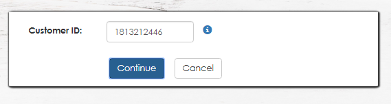

There is an information icon beside the input field, on click of it the scenarios on how Customer profile ID can be found (existing) or created are shown to the user.

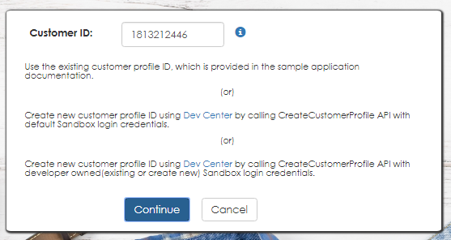

After providing the customer ID and click on Continue button, background script will be executed which calls the **Redirect** function.

```
//On click of continue button in accept customer pop up in dashboard page
function Redirect() {
    var customerId = '',
        result = '';
    document.getElementById('invalidCustomer').style.display = 'none';
    customerId = document.getElementById('txtCustomerId').value;
    if (customerId === '') {
        document.getElementById('txtCustomerId').focus();
        document.getElementById('invalidCustomer').style.display = 'inherit';
        document.getElementById('invalidCustomer').innerHTML = 'Please enter Customer ID';
    } else {
        //Validation of customer id will be done by using the below function
        result = validateCustomer(customerId);

        if (result.valid) {//if it is a valid customer id
            if (result.status) {
                window.location.href = 'index.html?producttype=acceptcustomer&customerid=' + customerId;
                //if Customer id is already validated
                sessionStorage.setItem('isValidated', 'true');
            } else {
                document.getElementById('invalidCustomer').style.display = 'inherit';
                document.getElementById('invalidCustomer').innerHTML = result.message;
            }
        } else {
            document.getElementById('invalidCustomer').style.display = 'inherit';
            document.getElementById('invalidCustomer').innerHTML = result.message;
        }
    }
}
```

In this functiopn, first the customer ID will be validated. 
An Ajax call is made by passing the provided customer ID to the web API to the URL ValidateCustomerRequestUrl in constants file for validating the ID.  

```
//ValidateCustomer function validates the customer id which is declared in the URL
function validateCustomer(id) {
    var customerId,
        result = {};
    customerId = id;
    //Below ajax call to API to validate the customer id
    $.ajax({
        type: 'GET',
        url: globalVars.ValidateCustomerRequestUrl,//Value fetched from the constants.js file
        data: {
            apiLoginId: globalVars.ApiLoginID,//Value fetched from the constants.js file
            apiTransactionKey: globalVars.ApiTransactionKey,//Value fetched from the constants.js file
            customerId: customerId
        },
        async: false,
        contentType: 'application/json; charset=utf-8',
        dataType: 'json',
        success: function (data) {
            var valid;
            if (data.status) {// if the customer id is valid
                valid = true;
            } else {
                valid = false;
            }
            result = {
                valid: valid,
                status: data.status,
                message: data.errorMessage
            };
        },
        error: function (textStatus) {
            result = {
                valid: false,
                status: false,
                message: textStatus
            };
        }
    });
    return result;
}
```
If it is a valid customer ID then the **acceptCustomer** method is called. 
If the customer ID is not valid we will display the error message recieved from the API call on the screen.

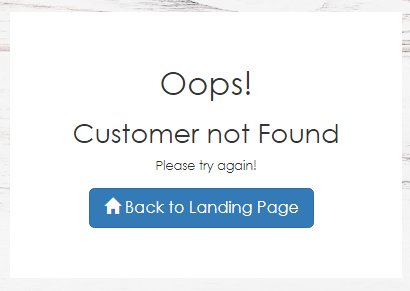

On click of Back to Home Page button, the page will be redirected to dashboard page.

The other scenario is also checked on loading the accept customer page, where the user by directly provides the customer ID as a query string in URL without populating it in the pop up and then loads the URL, the code first validates the customer ID parameter in the URL. 
If it is valid then only **acceptCustomer** function is invoked.

```
//AcceptCustomer functionality implementation
function acceptCustomer(id) {
    var customerId = id;

    // Below Ajax call to API to fetch token in response. Based on token form will be displayed
    $.ajax({
        type: 'GET',
        url: globalVars.AcceptCustomerRequestUrl,//Value fetched from the constants.js file
        data: {
            apiLoginId: globalVars.ApiLoginID,//Value fetched from the constants.js file
            apiTransactionKey: globalVars.ApiTransactionKey,//Value fetched from the constants.js file
            customerId: customerId,
            iFrameCommunicatorUrl: window.location.origin + '/acceptsuite-service/iframeCommunicator.html'
        },
        contentType: 'application/json; charset=utf-8',
        dataType: 'json',
        success: function (data) {
            if (data.status) {//if response is success
                //Assign the token value to the hidden field inside the form
                document.getElementById('custtoken').value = data.successValue;

                //To set url for the form in the HTML in Accept Customer section
                document.getElementById('send_token').setAttribute('action', 'https://test.authorize.net/customer/manage');

                //Submit form with token to load iframe
                document.getElementById('send_token').submit();
                document.getElementById('load_profile').style.display = 'block';
            } else {
                //on failure, show error message
                document.getElementById('msgCS').innerHTML = '';
                document.getElementById('msgCS').innerHTML = data.errorMessage;
                var element = document.getElementById('alertCS');
                element.classList.remove('alert-success');
                element.classList.add('alert-danger');
                element.style.display = 'block';
            }
            document.getElementById('acceptCustomer').style.display = 'block';
            document.getElementById('acceptCustomerId').style.display = 'none';
            document.getElementById('acceptCustomerManage').style.display = 'block';
        },
        error: function (textStatus) {
            document.getElementById('msgCS').innerHTML = '';
            document.getElementById('msgHS').innerHTML = textStatus;
            var element = document.getElementById('alertCS');
            element.classList.remove('alert-success');
            element.classList.add('alert-danger');
            element.style.display = 'block';
        }
    });
}
```

In this an Ajax call is made to the web API by passing the required parameters like customer ID, apiLoginId and apiTransactionKey. IframeCommunicator URL is also passed in Ajax for communicating between the hosted form and the web page.
As a response we will get the token value. 

A iframe is defined in the HTML which is used to embed the hosted payment form in the web page. 

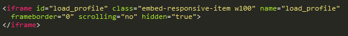

A form is also defined in the HTML with target ID of the above iframe. This form contains an input field for token. The action URL of the form is CustomerFormUrl in constants file which is defined dynamically on loading the Accept Customer page.

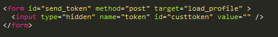

After receiving the token from the acceptCustomer function, the form is submitted by passing the received token to the input in the form.
When the form is posted, the accept customer form is automatically displayed on the screen.

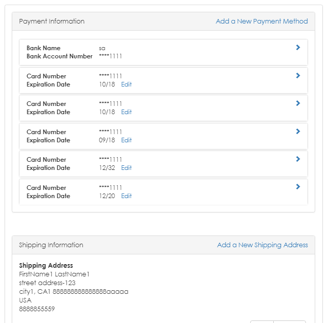

This form contains a Cancel button. On click of Cancel, the page will be redirected to the dashboard page.

In the hosted Accept Customer form, we can see the payment details and shipping details of the customer.
These payment and shipping details can be added, edited and deleted.

## Accessing Payment Profiles

The payment details section has both card payment details and bank account details.

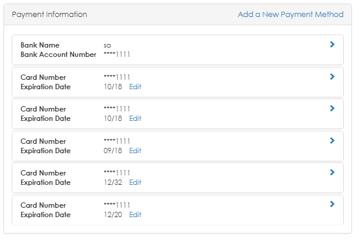

### Adding a Payment Profile

On click of Add a New Payment Method, a pop up is displayed with the payment fields. User can select between Card and Bank payment options and fill the respective details.
This form has Save and Cancel buttons. 

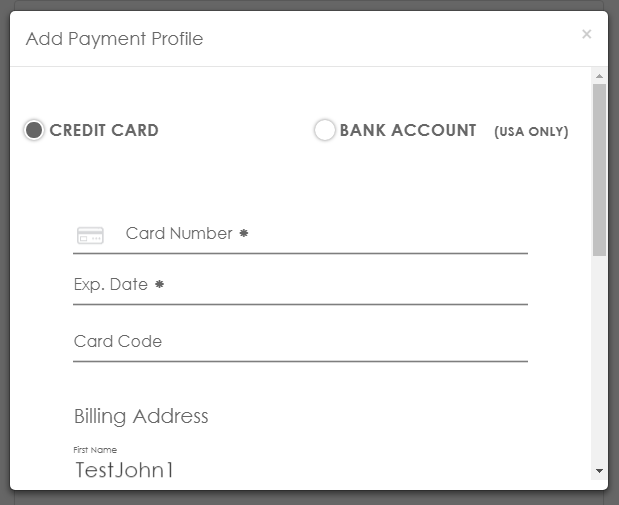

On click of Save, the payment details are saved and displays in the payment profiles list.

On click of Cancel, the pop up closes.

### Updating a Payment Profile

To edit the payment details we can click on the Edit button of the respective payment profile. Then a pop up with the payment details appears, we can edit these values.
This form has Save and Cancel buttons. 

The edit payment profile for Card details is as below,

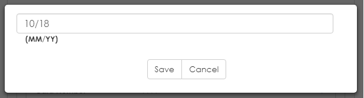

The edit payment profile for Bank details is as below,

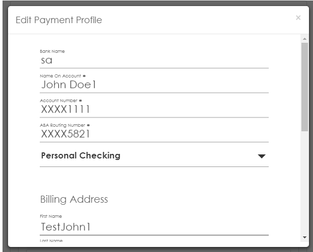

On click of Save, the payment details are updated and displays in the payment profiles list.

On click of Cancel, the pop up closes.

### Deleting a Payment Profile

We can also delete the existing payment details by clicking on the Delete button of the respective payment profile.

On click of Delete button, it asks for confirmation of the user to proceed.

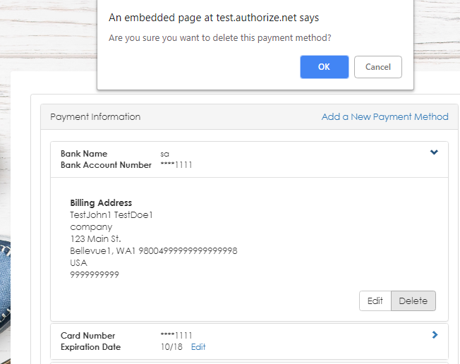

## Accessing Shipping Profiles

The shipping profiles contains the shipping addresses of the customer.

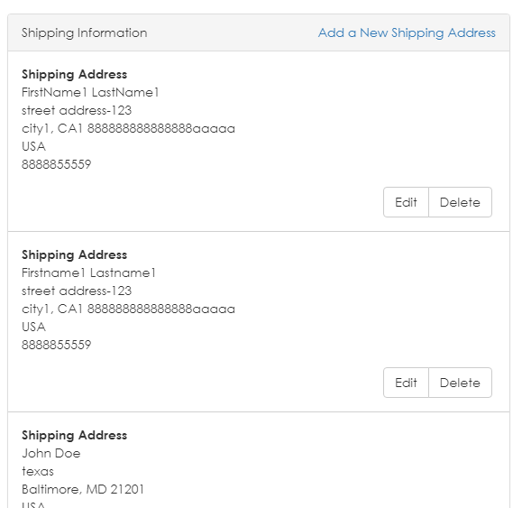

### Adding a Shipping Address

On click of Add a New Shipping Address, a pop up is displayed with the address fields. User can fill the required fields and save the information.
This form has Save and Cancel buttons. 

On click of Save, the shipping address details are saved and displays in the shipping profiles list.

On click of Cancel, the pop up closes.

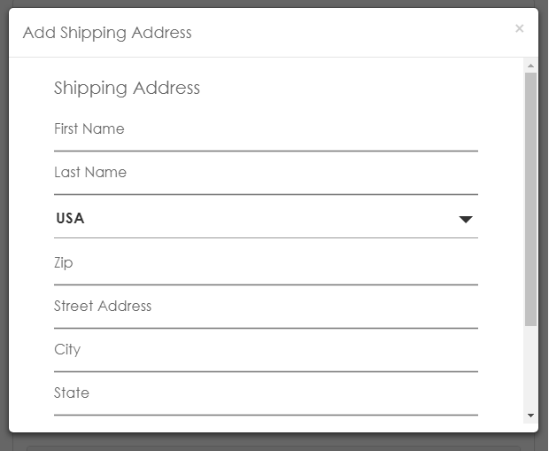

### Editing a Shipping Address

To edit the shipping address details we can click on the Edit button of the respective shipping profile. Then a pop up with the address details appears, we can edit these values.
This form has Save and Cancel buttons. 

On click of Save, the shipping address details are updated and displays in the shipping profiles list.

On click of Cancel, the pop up closes.

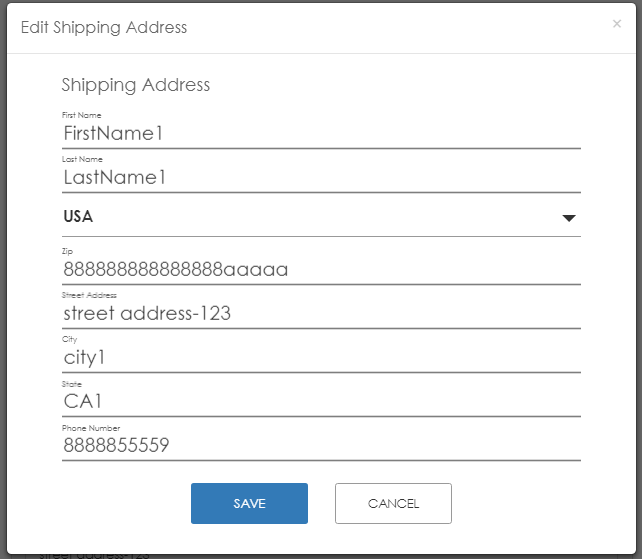

### Deleting a Shipping Address

We can also delete the existing shipping address by clicking on the Delete button of the respective shipping profile.

On click of Delete button, it asks for confirmation of the user to proceed.

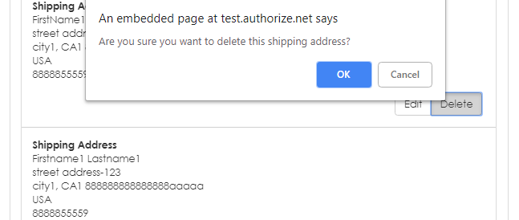