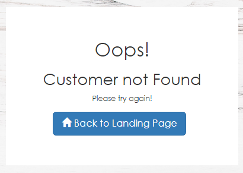
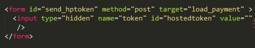

# Accept Hosted Step by Step

## Description

Accept Hosted provides a fully hosted, mobile-optimized payment form that uses an iframe for redirect or direct post of cardholder data to Authorize.Net.

Passing customer profile ID is optional in case of Accept Hosted. User can access Accept Hosted product type screen with or without passing customer profile ID. 

If a customer wants to send customer ID, it should be passed as a query string in the URL. The payment form will be displayed only if it is a valid customer ID.

The functionality for Accept Hosted is written in pure JavaScript and pages are designed using Bootstrap classes.

## Accessing Accept Hosted Page

There are two ways to navigate to Accept Hosted page.

* The Accept Hosted page can be accessed from the dashboard page by clicking on the Accept Hosted tab. This give the hosted form without customer ID.
* Access directly by providing the product type query string in the URL. 
 
The URL format for Accept Hosted is as follows,

https://IPAddress:PortNumber/acceptsuite-service/index.html?producttype=accepthosted

The URL format for Accept Hosted without Customer ID is as follows,
https://localhost:9444/acceptsuite-service/index.html?producttype=accepthosted

The URL format for Accept Hosted with passing customer ID is as follows,
https://localhost:9444/acceptsuite-service/index.html?producttype=accepthosted&CustomerId=1813212446

## Workflow

**Accept Hosted client-side functionality is written in *accept-hosted.js* javascript file(..\accept-sample-app-java\acceptsuiteservice\WebApp\assets\js\accept-suite\accept-hosted.js).**

Step 1 : On loading of Accept Hosted page, there are two cases to be checked.

* The page request contains Customer ID in the URL. 
* The page request does not provide Customer ID in the URL. 

### Case 1 : 

If customer ID is passed in the request URL then **validateCustomer** function gets executed. 

```
//ValidateCustomer function validates the customer id which is declared in the URL
function validateCustomer(id) {
    var customerId,
        result = {};
    customerId = id;
    //Below ajax call to API to validate the customer id
    $.ajax({
        type: 'GET',
        url: globalVars.ValidateCustomerRequestUrl,//Value fetched from the constants.js file
        data: {
            apiLoginId: globalVars.ApiLoginID,//Value fetched from the constants.js file
            apiTransactionKey: globalVars.ApiTransactionKey,//Value fetched from the constants.js file
            customerId: customerId
        },
        async: false,
        contentType: 'application/json; charset=utf-8',
        dataType: 'json',
        success: function (data) {
            var valid;
            if (data.status) {// if the customer id is valid
                valid = true;
            } else {
                valid = false;
            }
            result = {
                valid: valid,
                status: data.status,
                message: data.errorMessage
            };
        },
        error: function (textStatus) {
            result = {
                valid: false,
                status: false,
                message: textStatus
            };
        }
    });
    return result;
}
```

The customer ID is validated by making an Ajax call to a web API to the URL ValidateCustomerRequestUrl in constants file. 

If it is a valid customer ID then the **acceptHosted** method is called. 
If the customer ID is not valid we will display the error message like "customer not found" on the screen.



On click of **Back to Home Page** button, the page will be redirected to dashboard page.

### Case 2 : 

If customer ID is not provided in the request URL then on loading the page, **acceptHosted** function gets directly executed. 

```
//AcceptHosted functionality implementation
function acceptHosted(id) {
    var customerId = id;
    // Below Ajax call to API to fetch token in response. Based on token form will be displayed
    $.ajax({
        type: 'GET',
        url: globalVars.AcceptHostedRequestUrl,//Value fetched from the constants.js file
        data: {
            apiLoginId: globalVars.ApiLoginID,//Value fetched from the constants.js file
            apiTransactionKey: globalVars.ApiTransactionKey,//Value fetched from the constants.js file
            iFrameCommunicatorUrl: window.location.origin + '/acceptsuite-service/iframeCommunicator.html', 
            customerId: customerId
        },
        contentType: 'application/json; charset=utf-8',
        dataType: 'json',
        success: function (data) {
            if (data.status) {//if the response is success
                //Assign the token value to the hidden field inside the form
                document.getElementById('hostedtoken').value = data.successValue;

                //To set action url for the form in HTML in Accept Hosted section
                document.getElementById('send_hptoken').setAttribute('action', 'https://test.authorize.net/payment/payment');

                //submit form with token to load iframe
                document.getElementById('send_hptoken').submit();
                document.getElementById('acceptHosted').style.display = 'block';
                document.getElementById('load_payment').style.display = 'block';
            } else {
                //on failure, show error message
                document.getElementById('msgHS').innerHTML = '';
                document.getElementById('msgHS').innerHTML = data.errorMessage;
                var element = document.getElementById('alertHS');
                element.classList.remove('alert-success');
                element.classList.add('alert-danger');
                element.style.display = 'block';
                document.getElementById('acceptHosted').style.display = 'block';
            }

        },
        error: function (textStatus) {
            document.getElementById('msgHS').innerHTML = '';
            document.getElementById('msgHS').innerHTML = textStatus;
            var element = document.getElementById('alertHS');
            element.classList.remove('alert-success');
            element.classList.add('alert-danger');
            element.style.display = 'block';
        }
    });
}
```

In this method we request the token by calling the Authorize.Net API "Get Hosted Payment Page Request" by using the parameter AcceptHostedRequestUrl from constants file in the ajax call.
As a response token is received.

iFrameCommunicatorUrl is also passed through Ajax, which will be explained in detail further.

Step 2 : An iframe is defined in the HTML which is used to embed the Accept Hosted payment form in the web page. 


Step 3 : A form is also defined in the HTML with target ID of the above iframe. This form contains an input field for token. The action URL of the form is HostedFormUrl in constants file which is defined dynamically on loading the Accept Hosted page.



Step 4 : After receiving the token from the acceptHosted method, the form in the HTML is submitted by passing the received token to the input field in the form.

When the form is posted, the hosted payment form is automatically displayed on the screen.

Below form is when accessing Accepted Hosted product type without passing customer ID.


Below form is when accessing Accepted Hosted product type if customer profile ID is passed via Query string, we are displaying four most recent payment profiles associated with the customer profile ID. The customer can choose between these payment methods or choose to use a new payment method. 


Accept Hosted will have Credit card and Bank account as payment options. There are two buttons Pay and Cancel.

## Iframe Communicator

IFrameCommunicator is a small html page hosted on domain containing a JavaScript that listens for events we can receive inputs related to response and this parameter has to be set in hostedPaymentSettings.

To securely communicate between our Accept Hosted form and your web page, we need a communicator page which will be hosted on your site alongside your checkout/payment page. This enables a channel of communication that allows to send messages to IFrameCommunicator page. Then, as long as IFrameCommunicator page is hosted on the same domain as main page, it can communicate back to main page.

The URL of the communicator page is passed in your token request, which will allow Authorize.Net to embed the communicator page in the payment form.

A communication handler is written in **app.js javascript file(..\accept-sample-app-java\acceptsuiteservice\WebApp\assets\js\accept-suite\app.js)** to receive the messages of iframe communicator and executes the script based on the message received.

```
//Methods for accept hosted/accept customer iframes that executes on receiving message in iframeCommunicator
CommunicationHandler.onReceiveCommunication = function (argument) {
    var params = parseQueryString(argument.qstr),
        parentFrame = argument.parent.split('/')[4],
        frame = null,
        transResponse = {},
        currentdate = '';
    switch (parentFrame) {
        //Accept hosted form is fetched
    case 'manage':
        frame = document.getElementById('load_profile');
        break;
        //Accept customer form is fetched
    case 'payment':
        frame = document.getElementById('load_payment');
        break;
    }

    switch (params.action) {
        //To resize the iframe used in accept hosted and accept customer
        case 'resizeWindow':
        //Below code resizes the accept customer form
        if (parentFrame === 'manage' && parseInt(params.height, 10) < 1150) {
            //Kept for future reference, Currently the height and width is adjusted through css
            //params['height']=450;
            //params['width']=800;
            }
        //Below code resizes the accept hosted form
        if (parentFrame === 'payment' && parseInt(params.height, 10) < 1000) {
                //Kept for future reference, Currently the height and width is adjusted through css
                //params['height']=330;
                //params['width']=50;
            }
        //Below code resizes the accept hosted form
        if (parentFrame === 'payment' && getComputedStyle(document.querySelector('.w100')).width < '687.297px') {
            params.height = +params.height + 100;
            frame.height = parseInt(params.height, 10);
            frame.width = parseInt(params.width, 10);
        } else {
            frame.height = parseInt(params.height, 10);
            frame.width = parseInt(params.width, 10);
        }
        break;

        //on click on cancel button in accept hosted, it gets redirected to dashboard page
    case 'cancel':
        if (parentFrame === 'payment') {
            window.location.href = 'index_all.html';
        }
        break;

        //On successful payment in Accept Hosted below code gets executed and confirmation page is displayed
    case 'transactResponse':
        transResponse = JSON.parse(params.response);
        if (parentFrame === 'payment') {
            //To hide payment and cart panels and show confirmation page
            document.getElementById('cartHosted').style.display = 'none';
            document.getElementById('hostedPayment').style.display = 'none';

            //To append current time and date in confirmation page
            currentdate = new Date(transResponse.dateTime + ' UTC');
            document.getElementById('orderID').innerHTML = transResponse.transId;
            document.getElementById('orderDate').innerHTML = currentdate;
            document.getElementById('confirmationPage').style.display = 'block';
        }
        break;
    }
};
```

This channel of communication is used to pass a few basic messages back to a listener script running on main page (the page that calls the form):

*	Ideal height and width of the window - enables you to resize the frame and avoid any scrollbars from appearing.
    
	Here resizeWindow function is called in communication handler where we can set custom height and width of the hosted payment form in the iframe .
	
	
	
*	Request Succeeded - returned when the transaction is completed at Authorize.Net. You can use this notification to know when to look for those changes through the Transaction Reporting API. Transaction response parameters (such as transaction ID) are returned with this notification.

    When we click on Pay button the payment happens in the background and the iframeCommunicator html page receives a message on successful payment.
    Then the transactResponse function is called in communication handler which gives the transaction response with requires parameters like transaction ID and transaction date and time.
	
	
	
	A confirmation page with transaction details is displayed on successful payment.
	
	
	
*	Request Cancelled - returned when the customer cancels the hosted form.
    
	On click of Cancel button in the payment form, the cancel function in communication handler is invoked which redirects the page to dashboard page.
    
	