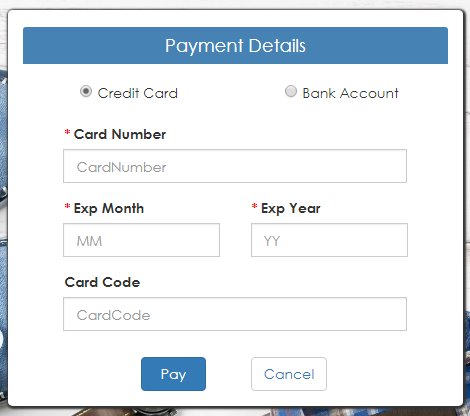
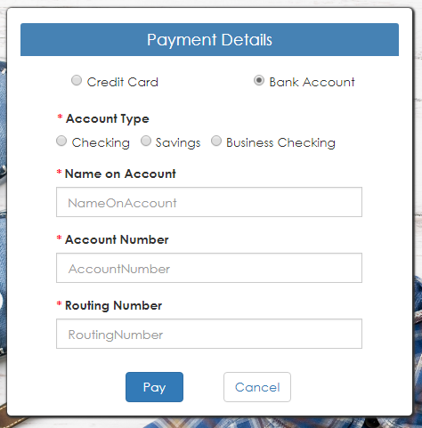
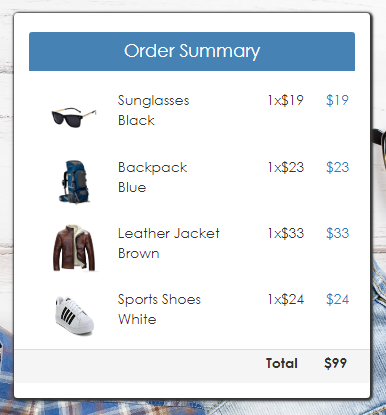
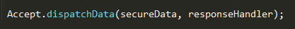

# Accept.js Description

Accept.js is a JavaScript-based solution for sending secure payment data directly to Authorize.Net. The Accept JavaScript library intercepts the payment data before it is passed to merchant server and instead submits it directly to Authorize.Net.

## Prerequisite

* In Order to utilize the functionality, please provide the below plugin in the HTML file.

SANDBOX: https://jstest.authorize.net/v1/Accept.js  

* The functionality for Accept.js is written in pure JavaScript and pages are designed using Bootstrap classes.

## Accessing Accept.js Page

There are two ways to navigate to Accept.js page.

* The Accept.js page can be accessed from the dashboard page by clicking on the Accept.js tab. 
* Access directly by providing the product type query string in the URL.
 
The URL format for Accept.js is as follows,

https://IPAddress:PortNumber/acceptsuite-service/index.html?producttype=acceptjs

## Workflow

Accept.js accepts both card and bank payments. A screen/form is created with the below mentioned fields for card and bank payment with required validations.  

### Card Payment Fields



Below are the sample card details for reference,

* CardNumber : 4111111111111111
* ExpMonth : 12
* ExpYear : 18
* CardCode : 123

Here Card number , Expiry month and Expiry year are mandatory fields and Card code is optional field.

### Bank Payment Fields



Below are the sample bank details for reference,

* AccountNumber =  4111111
* RoutingNumber =   122235821
* NameOnAccount = John Doe
* AccountType = checking

Here all the four fields in bank details are mandatory.

Shopping cart information is also provided beside the payment form with static content.



On click of Cancel button, the page will be redirected to dashboard page.

When click on Pay button in the payment form, the request is sent to the web service.

Based on the response code of the API call whether Success / Failed we will read the response and will display the confirmation page with Thank You message on the screen and with other details like transaction ID and transaction date on successful transaction.


On click of Done button, the page will be redirected to dashboard page.

### Understanding Accept.js Functionality

**Accept.js client-side functionality is written in *accept.js* javascript file(..\accept-sample-app-java\acceptsuiteservice\WebApp\assets\js\accept-suite\accept.js).**

As soon as the user gets redirected to the Accept.js page from the dashboard page, **showData** function gets executed.

```
//On click of radio buttons in Accept.js page
function showData(option) {
    document.getElementById('msg').innerHTML = '';
    document.getElementById('alert').style.display = 'none';
    if (option === 'card') {
        document.getElementById('bank').style.display = 'none';
        document.getElementById('card').style.display = 'block';
    } else {
        document.getElementById('card').style.display = 'none';
        document.getElementById('bank').style.display = 'block';
    }
    document.getElementById('btns').style.display = 'block';
}
```
This function shows the payment form with relavant fields for card/bank details based on the selection of the payment type by the user.
By default the **credit card** radio button is selected.

On click of Pay button, **sendPaymentDataToAnet** function will get executed.

```
//Send payment information on Pay button click in Accept.js page
function sendPaymentDataToAnet() {
    var isvalid = validatePaymentFields(),
        authData = {},
        sel = '',
        cardData = {},
        bankData = {},
        secureData = {};
    //if all fields are valid
    if (isvalid === 'true') {
        authData.clientKey = globalVars.ClientKey;//Value fetched from the constants.js file
        authData.apiLoginID = globalVars.ApiLoginID;//Value fetched from the constants.js file

        sel = document.querySelector('input[name="optradio"]:checked').value;

        //Based on the value selected from the radio buttons, either card or bank, the data is fetched from the form
        if (sel === 'card') {
            cardData.cardNumber = cardNo.value;
            cardData.month = expMonth.value;
            cardData.year = expYear.value;
            cardData.cardCode = cardCode.value;
        } else {
            bankData.accountNumber = accountNumber.value;
            bankData.routingNumber = routingNumber.value;
            bankData.nameOnAccount = nameOnAccount.value;
            bankData.accountType = document.querySelector('input[name="acntradio"]:checked').value;
        }
        secureData.authData = authData;
        if (sel === 'card') {
            secureData.cardData = cardData;
        } else {
            secureData.bankData = bankData;
        }
        //Sending payment data to dispatch data method which is available in accept JS plugin
        Accept.dispatchData(secureData, responseHandler);
    }
}
```

In this function, the fields in the payment form are validated first. **validatePaymentFields** does the required validation of the fields

```
//To validate fields in Accept JS form
function validatePaymentFields() {
    var sel = document.querySelector('input[name="optradio"]:checked').value,
        radios = '',
        val = '',
        iserror = '',
        element = '';
    if (sel === 'card') {
        if (cardNo.value === '') {
            cardNo.classList.add('error');
        } else {
            cardNo.classList.remove('error');
            cardNo.classList.add('success');
        }
        if (expMonth.value === '') {
            expMonth.classList.add('error');
        } else {
            expMonth.classList.remove('error');
            expMonth.classList.add('success');
        }
        if (expYear.value === '') {
            expYear.classList.add('error');
        } else {
            expYear.classList.remove('error');
            expYear.classList.add('success');
        }
    } else {

        if (accountNumber.value === '') {
            accountNumber.classList.add('error');
        } else {
            accountNumber.classList.remove('error');
            accountNumber.classList.add('success');
        }
        if (routingNumber.value === '') {
            routingNumber.classList.add('error');
        } else {
            routingNumber.classList.remove('error');
            routingNumber.classList.add('success');
        }
        if (nameOnAccount.value === '') {
            nameOnAccount.classList.add('error');
        } else {
            nameOnAccount.classList.remove('error');
            nameOnAccount.classList.add('success');
        }
        //To get selected value of account type
        radios = document.getElementsByName('acntradio');
        Array.prototype.forEach.call(radios, function (radio) {
            if (radio.checked) {
                val = radio.value;
            }
        });

        if (val === '' || val === null) {
            document.querySelector('input[name="acntradio"]').classList.add('error');
        } else {
            document.querySelector('input[name="acntradio"]').classList.remove('error');
            document.querySelector('input[name="acntradio"]').classList.add('success');
        }
    }

    iserror = document.getElementById(sel).getElementsByClassName('error');
    if (iserror.length > 0) {//if an element with error class exists
        document.getElementById('errDetails').style.display = 'none';
        document.getElementById('msg').innerHTML = '';
        document.getElementById('msg').innerHTML = 'Please provide all required fields';
        element = document.getElementById('alert');
        element.classList.remove('alert-success');
        element.classList.add('alert-danger');
        element.style.display = 'block';
        return 'false';
    }
    return 'true';
}
```

The validatePaymentFields function first checks for the payment type selected by the user. Based on it, it will validate the mandatory payment
fields and check for any empty input fields.

If there are any empty fields it will ask the user to enter data the required fields.This function returns **true** if all the fields
are valid and **false** if any one of the mandatory field is empty.

When user provided values for all the required fields, based on the selection of payment type between Credit card and Bank Account, Accept.js extracts the payment details from customer’s form as an object named secureData and sends them directly from the customer's web browser.
A response handler function is also written to handle the response of Dispatch Data which returns payment nonce or token.

Accept JS plugin is an existing plugin and Dispatch Data functionality is already present in that plugin. 

The payment data object and response handler function are passed to Authorize.Net using Dispatch Data functionality. 



The response handler gets the response from Dispatch Data. This function checks whether the response has any error, if so the errors are displayed on the page.

If there are no errors then the response handler gets the opaqueData from the response which contains dataValue field which is the token value
and then calls the **showConfirmationPage** function by passing the response to it.

```
//Response handler for accept js and accept ui
function responseHandler(response) {
    var i = 0,
        container = document.getElementById('msg'),
        value = '',
        element = '',
        node = '',
        msgdiv = '',
        tokenVal = '';
    //if response has errors, then the below code gets executed
    if (response.messages.resultCode === 'Error') {
        container.innerHTML = '';
        //element = document.createElement('p');
        //node = document.createTextNode('Error Details :');
        //element.appendChild(node);
        //container.appendChild(element);
       
        //To display all errors occured on the page
        while (i < response.messages.message.length) {
            value = response.messages.message[i].code + ': ' + response.messages.message[i].text;

            //All the error messages are added to a div element
            element = document.createElement('p');
            node = document.createTextNode(value);
            element.appendChild(node);

            container.appendChild(element);
            i = i + 1;
        }

        //Display the error section
        document.getElementById('errDetails').style.display = 'block';
        msgdiv = document.getElementById('alert');
        msgdiv.classList.remove('alert-success');
        msgdiv.classList.add('alert-danger');
        msgdiv.style.display = 'block';
    } else {
        dataDescriptor.value = response.opaqueData.dataDescriptor;
        dataValue.value = response.opaqueData.dataValue;
        tokenVal = document.getElementById('dataValue').value;

        //Below function calls the web API and shows confirmation page on successful payment
        showConfirmationPage(tokenVal);
    }
}
```

After receiving the payment nonce / token from the response we will pass this token to the showConfirmationPage function.

```
//Below function calls the web API for accept.js/accept ui by passing the token value and shows confirmation page on successful payment
function showConfirmationPage(tokenVal) {
    // Ajax call to API by passing token. Based on the response, if payment gets success confirmation page is displayed to the user
    $.ajax({
        type: 'GET',
        url: globalVars.AcceptJSRequestUrl,//Value fetched from the constants.js file
        data: {
            apiLoginId: globalVars.ApiLoginID,//Value fetched from the constants.js file
            apiTransactionKey: globalVars.ApiTransactionKey,//Value fetched from the constants.js file
            token: tokenVal
        },
        contentType: 'application/json; charset=utf-8',
        dataType: 'json',
        success: function (data) {
            var currentdate = '',
                element = '';
            switch (activeCont) {
                //if payment is done using accept.js product type
                case 'acceptjs':
                    document.getElementById('alert').style.display = 'none';
                    document.getElementById('msg').innerHTML = '';

                    //Belo function clears all input fields in accept.js
                    paymentFormUpdate();
                    if (data.status) {//On successful payment, below code gets executed
                        //To disable pay button
                        document.getElementById('btnPayJS').disabled = true;
                        //To append current datetime and transaction id in confirmation page
                        currentdate = new Date();
                        document.getElementById('orderID').innerHTML = data.successValue;
                        document.getElementById('orderDate').innerHTML = currentdate;
                        document.getElementById('cartJS').style.display = 'none';
                        document.getElementById('paymentDivJS').style.display = 'none';
                        document.getElementById('confirmationPage').style.display = 'block';
                    } else {
                        //on failure, show error message
                        document.getElementById('msg').innerHTML = data.errorMessage;
                        element = document.getElementById('alert');
                        element.classList.remove('alert-success');
                        element.classList.add('alert-danger');
                        element.style.display = 'block';
                    }
                    break;
                //if payment is done using accept ui product type
                case 'acceptui':
                    document.getElementById('alertUI').style.display = 'none';
                    document.getElementById('msgUI').innerHTML = '';
                    if (data.status) {//on successful payment below code gets executed
                        //To disable pay button
                        document.getElementById('btnAcceptUI').disabled = true;
                        //To append current datetime and transaction id in confirmation page
                        currentdate = new Date();
                        document.getElementById('orderID').innerHTML = data.successValue;
                        document.getElementById('orderDate').innerHTML = currentdate;
                        document.getElementById('cartUI').style.display = 'none';
                        document.getElementById('confirmationPage').style.display = 'block';
                    } else {
                        //on failure in payment, show error message
                        document.getElementById('msgUI').innerHTML = data.errorMessage;
                        element = document.getElementById('alertUI');
                        element.classList.remove('alert-success');
                        element.classList.add('alert-danger');
                        element.style.display = 'block';
                    }
                    break;
            }
        },
        error: function (textStatus) {
            var element = '';
            switch (activeCont) {
                case 'acceptjs':
                    document.getElementById('msg').innerHTML = '';
                    document.getElementById('msg').innerHTML = textStatus;
                    element = document.getElementById('alert');
                    element.classList.remove('alert-success');
                    element.classList.add('alert-danger');
                    element.style.display = 'block';
                    break;
                case 'acceptui':
                    document.getElementById('msgUI').innerHTML = '';
                    document.getElementById('msgUI').innerHTML = textStatus;
                    element = document.getElementById('alertUI');
                    element.classList.remove('alert-success');
                    element.classList.add('alert-danger');
                    element.style.display = 'block';
                    break;
            }
        }
    });
}
```

In this function, ajax call is made to the web API method by passing the required data like apiLoginId, apiTransactionKey and tokenVal for the payment.

On successful payment, the **paymentFormUpdate** function gets executed first.

The paymentFormUpdate function resets and clears all the field values in the payment form in Accept.js.

```
//Accept.js paymentFormUpdate functionality implementation
function paymentFormUpdate() {
    // To blank out the fields before submitting them to your server.
    //Clear all fields on submit in accept js
    cardNo.value = '';
    expMonth.value = '';
    expYear.value = '';
    cardCode.value = '';
    accountNumber.value = '';
    routingNumber.value = '';
    nameOnAccount.value = '';
    var rds = document.getElementsByName('acntradio'),
        cardNumElem = document.querySelector('input[name="cardNumber"]'),
        element = '';
    if (cardNumElem.value === '') {
        cardNumElem.classList.remove('icon-type-mastercard');
        cardNumElem.classList.remove('icon-type-dinersclub');
        cardNumElem.classList.remove('icon-type-amex');
        cardNumElem.classList.remove('icon-type-discover');
        cardNumElem.classList.remove('icon-type-jcb');
        cardNumElem.classList.remove('icon-type-visa');
    }

    Array.prototype.forEach.call(rds, function (rd) {
        rd.checked = false;
    });

    element = document.getElementsByClassName('error');
    while (element.length) {
        element[0].classList.remove('error');
    }

    element = document.getElementsByClassName('success');
    while (element.length) {
        element[0].classList.remove('success');
    }
}
```

After the payment form is cleared, the confirmation page with required details like order ID and order date is displayed to the user.

If the payment is not successful, then the error section with the error message received from the API call is shown on the page.