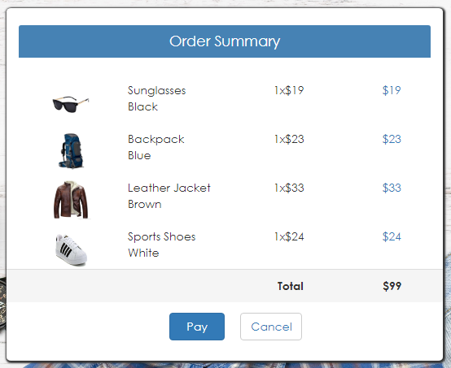
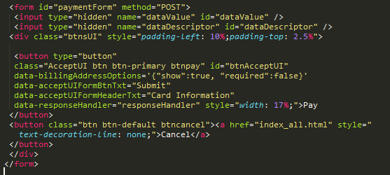

# Accept.js with UI Description

In this we embed the built-in ANET hosted form in our application to capture and send sensitive payment information directly to Authorize.Net.

## Prerequisite

* In Order to utilize the functionality, please provide the below plugin in the HTML file.

SANDBOX: https://jstest.authorize.net/v3/AcceptUI.js    
 
* The functionality for Accept.js with UI is written in pure JavaScript and pages are designed using Bootstrap classes.

## Accessing Accept.js UI Page

There are two ways to navigate to Accept.js UI page.

* The Accept.js UI page can be accessed from the dashboard page by clicking on the Accept.js UI tab. 
* Access directly by providing the product type query string in the URL.
 
The URL format for Accept.js UI is as follows,

https://IPAddress:PortNumber/projectname/index.html?producttype=acceptui

## Workflow

Shopping cart information with static content is displayed initially on the page with Pay and Cancel buttons.



On click of Cancel button, the page will be redirected to dashboard page.

The Pay button is defined on the page inside a form and when the customer clicks on the button the payment form will be displayed. 



There is a predefined angular directive for the button, we just need to fill the required values for button dynamically in the script.

Below is the screenshot of existing payment form for Accept.js with UI.


Below are the sample card details for reference,

* CardNumber : 4111111111111111
* ExpDate : 12/18
* CardCode : 123
* FirstName : John 
* LastName : Doe
* Zip : 21201

The customer fills the payment information in the form, and clicks the pay button.
Then the request is sent to the web service and based on the response code of the API call whether Success / Failed we will read the response and will display the confirmation page with Thank You message on the screen and with other details like transaction ID and transaction date on successful transaction.


### Understanding Accept.js UI Functionality

[Accept.js UI client-side functionality is written in *accept.js* javascript file](https://github.com/dinsahu/JavaAPITest/blob/master/acceptsuiteservice/WebApp/assets/js/accept-suite/accept.js).

When the user redirects from dashboard page to the Accept.js UI page, **acceptUI** function gets executed.

```
//AcceptUI functionality implementation
function acceptUI() {

    //To set the action URL for the payment form in Accept UI section
    var form = document.getElementById('paymentForm'),
        ele = '';
    form.setAttribute('action', window.location.href.split('?')[0]);

    //Accept UI pay button has predefined attributes that are declared below.
    //To set values for accept UI Pay button
    ele = document.getElementById('btnAcceptUI');

    //Below values are fetched from the constants.js file
    ele.setAttribute('data-apiLoginID', globalVars.ApiLoginID);
    ele.setAttribute('data-clientKey', globalVars.ClientKey);
}
```
This function sets the values for some of the attributes for the Pay button and payment form used in Accept.js UI. These values need to 
be predefined before the payments.

When the customer clicks on the Pay button the payment form will be displayed. Once the user should provides the required values and
clicks on submit button, the Accept script sends the payment information directly to Authorize.Net. 

A response handler function is defined for the Pay button which handles the response of the payment transaction.

```
//Response handler for accept js and accept ui
function responseHandler(response) {
    var i = 0,
        container = document.getElementById('msg'),
        value = '',
        element = '',
        node = '',
        msgdiv = '',
        tokenVal = '';
    //if response has errors, then the below code gets executed
    if (response.messages.resultCode === 'Error') {
        container.innerHTML = '';
        //element = document.createElement('p');
        //node = document.createTextNode('Error Details :');
        //element.appendChild(node);
        //container.appendChild(element);
       
        //To display all errors occured on the page
        while (i < response.messages.message.length) {
            value = response.messages.message[i].code + ': ' + response.messages.message[i].text;

            //All the error messages are added to a div element
            element = document.createElement('p');
            node = document.createTextNode(value);
            element.appendChild(node);

            container.appendChild(element);
            i = i + 1;
        }

        //Display the error section
        document.getElementById('errDetails').style.display = 'block';
        msgdiv = document.getElementById('alert');
        msgdiv.classList.remove('alert-success');
        msgdiv.classList.add('alert-danger');
        msgdiv.style.display = 'block';
    } else {
        dataDescriptor.value = response.opaqueData.dataDescriptor;
        dataValue.value = response.opaqueData.dataValue;
        tokenVal = document.getElementById('dataValue').value;

        //Below function calls the web API and shows confirmation page on successful payment
        showConfirmationPage(tokenVal);
    }
}
```

This function checks whether the response has any error, if so the errors are displayed on the page.

If there are no errors then the response handler gets the opaqueData from the response which contains dataValue field which is the token value
and then calls the **showConfirmationPage** function by passing the response to it.

After receiving the payment nonce / token from the response we will pass this token to the showConfirmationPage function.

```
//Below function calls the web API for accept.js/accept ui by passing the token value and shows confirmation page on successful payment
function showConfirmationPage(tokenVal) {
    // Ajax call to API by passing token. Based on the response, if payment gets success confirmation page is displayed to the user
    $.ajax({
        type: 'GET',
        url: globalVars.AcceptJSRequestUrl,//Value fetched from the constants.js file
        data: {
            apiLoginId: globalVars.ApiLoginID,//Value fetched from the constants.js file
            apiTransactionKey: globalVars.ApiTransactionKey,//Value fetched from the constants.js file
            token: tokenVal
        },
        contentType: 'application/json; charset=utf-8',
        dataType: 'json',
        success: function (data) {
            var currentdate = '',
                element = '';
            switch (activeCont) {
                //if payment is done using accept.js product type
                case 'acceptjs':
                    document.getElementById('alert').style.display = 'none';
                    document.getElementById('msg').innerHTML = '';

                    //Belo function clears all input fields in accept.js
                    paymentFormUpdate();
                    if (data.status) {//On successful payment, below code gets executed
                        //To disable pay button
                        document.getElementById('btnPayJS').disabled = true;
                        //To append current datetime and transaction id in confirmation page
                        currentdate = new Date();
                        document.getElementById('orderID').innerHTML = data.successValue;
                        document.getElementById('orderDate').innerHTML = currentdate;
                        document.getElementById('cartJS').style.display = 'none';
                        document.getElementById('paymentDivJS').style.display = 'none';
                        document.getElementById('confirmationPage').style.display = 'block';
                    } else {
                        //on failure, show error message
                        document.getElementById('msg').innerHTML = data.errorMessage;
                        element = document.getElementById('alert');
                        element.classList.remove('alert-success');
                        element.classList.add('alert-danger');
                        element.style.display = 'block';
                    }
                    break;
                //if payment is done using accept ui product type
                case 'acceptui':
                    document.getElementById('alertUI').style.display = 'none';
                    document.getElementById('msgUI').innerHTML = '';
                    if (data.status) {//on successful payment below code gets executed
                        //To disable pay button
                        document.getElementById('btnAcceptUI').disabled = true;
                        //To append current datetime and transaction id in confirmation page
                        currentdate = new Date();
                        document.getElementById('orderID').innerHTML = data.successValue;
                        document.getElementById('orderDate').innerHTML = currentdate;
                        document.getElementById('cartUI').style.display = 'none';
                        document.getElementById('confirmationPage').style.display = 'block';
                    } else {
                        //on failure in payment, show error message
                        document.getElementById('msgUI').innerHTML = data.errorMessage;
                        element = document.getElementById('alertUI');
                        element.classList.remove('alert-success');
                        element.classList.add('alert-danger');
                        element.style.display = 'block';
                    }
                    break;
            }
        },
        error: function (textStatus) {
            var element = '';
            switch (activeCont) {
                case 'acceptjs':
                    document.getElementById('msg').innerHTML = '';
                    document.getElementById('msg').innerHTML = textStatus;
                    element = document.getElementById('alert');
                    element.classList.remove('alert-success');
                    element.classList.add('alert-danger');
                    element.style.display = 'block';
                    break;
                case 'acceptui':
                    document.getElementById('msgUI').innerHTML = '';
                    document.getElementById('msgUI').innerHTML = textStatus;
                    element = document.getElementById('alertUI');
                    element.classList.remove('alert-success');
                    element.classList.add('alert-danger');
                    element.style.display = 'block';
                    break;
            }
        }
    });
}
```

In this function, ajax call is made to the web API method by passing the required data like apiLoginId, apiTransactionKey and tokenVal for the payment.

On successful payment, the confirmation page with required details like order ID and order date is displayed to the user.

If the payment is not successful, then the error section with the error message received from the API call is shown on the page.